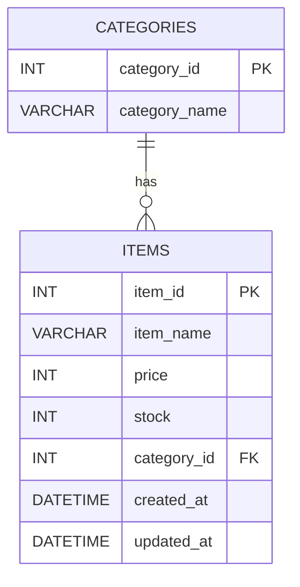
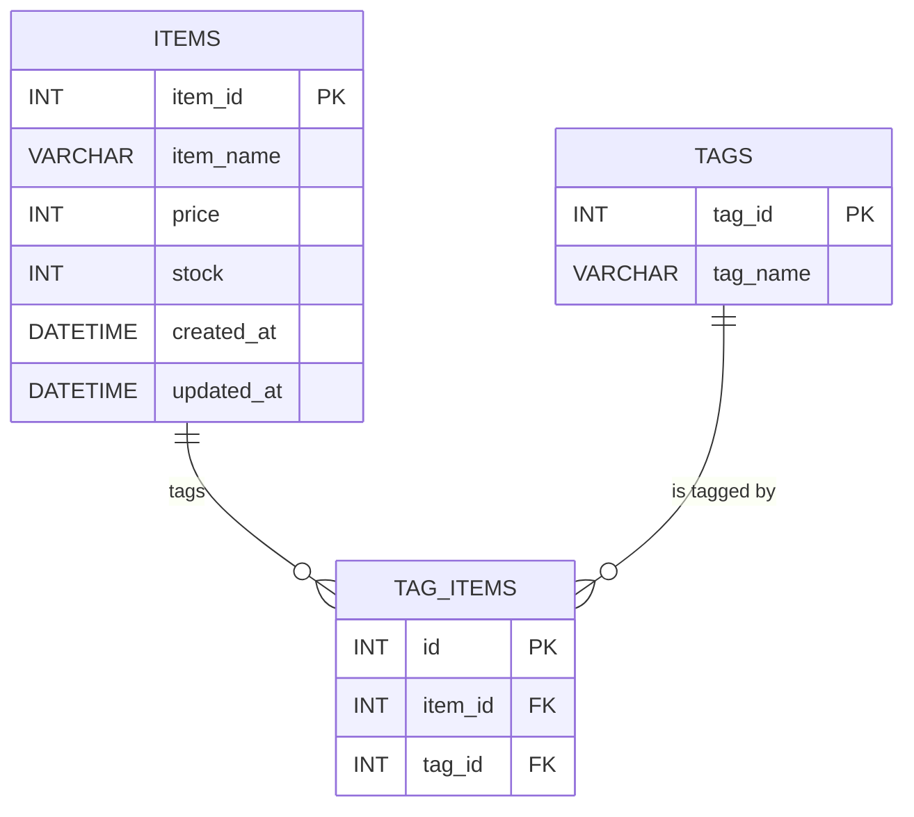

## はじめに

### 対象読者

初めて DB 設計を行う初心者

### ゴール

簡単な Web アプリケーションで使用する DB の設計ができるようになる．DB の設計はテーブル・カラム・リレーションを理解することが重要になる．

### 記事の概要

- Web アプリケーションの機能（画面設計）から DB を設計する流れを解説する．

- Excel などを用いて可視化する方法や，実データを入れて検証する重要性を紹介する．

- 正規化の詳しい解説は行わないが，代表的なアンチパターンに触れる．

## DB 設計でやること

- **テーブルを設計する**：エンティティ（モノや概念）ごとにテーブルを設計する．

- **カラムを設計する**：エンティティに付随する情報をカラムとして設計する．

- **リレーションを設計する**：エンティティの連携を考慮し，テーブル間の関係性を設計する．

## テーブルの設計

DB 設計は，Web アプリケーションの基盤となる重要な作業である．ここでは，初めて DB 設計を行う初心者向けに，テーブルの設計方法を解説する．

テーブル設計の流れは以下の通りである．

1. **アプリケーションの画面・機能を確認する**

   - 例）ユーザー登録画面，商品一覧画面，購入履歴画面など．

   - 画面ごとに「どんな情報が必要になるか」を一覧化する．

2. **必要なエンティティ（モノや概念）を見つける**

   - 例）「ユーザー」エンティティ，「商品」エンティティ，「購入履歴」エンティティ など．

   - 画面や機能に登場する「名詞」をリストアップしてテーブル候補とする．

3. **テーブルとしてまとめる**

   - リストアップした名詞を「テーブル名（エンティティ名）」に設定する．

   - 複数の画面にまたがる情報があれば，一つのテーブルに集約するのか，複数に分割するのかを検討する．

## カラムの設計

### カラムの設計手順

1. **各テーブルに必要なカラムを洗い出す**

   - 画面項目やビジネスルールからカラムを想定．

   - 例）ユーザーテーブルの場合：ユーザー名，メールアドレス，パスワード，権限 など．

   - 例）todo テーブルの場合：タスク名，期限日，完了フラグ など．

2. **主キー（PK: Primary Key）や必要な制約の設定**

   - ユーザーテーブルなら `id` や `user_id` など一意に識別できる主キーを設定．

   - 主キーとは，テーブル内で一意に識別できるカラムのこと．

   - 重複を許さないカラムがあればユニーク制約を検討（例：メールアドレス）．

3. **データ型や NULL 許可/非許可なども考慮**

   - 例）文字列型，数値型，日付型など．

   - 必ず値が必要なカラムは NOT NULL 制約をつける など．

### 具体例

例えば，商品テーブルを以下のように検討する．Excel などではこのような形で可視化すると便利．

| 項目     | カラム名   | データ型     | 主キー(PK) | NOT NULL | ユニーク制約 | 備考                             |
| -------- | ---------- | ------------ | ---------- | -------- | ------------ | -------------------------------- |
| 商品 ID  | item_id    | INT          | ○          | ○        | ○            | オートインクリメント             |
| 商品名   | item_name  | VARCHAR(100) |            | ○        |              |                                  |
| 価格     | price      | INT          |            | ○        |              |                                  |
| 在庫数   | stock      | INT          |            | ○        |              |                                  |
| カテゴリ | category   | VARCHAR(50)  |            | ○        |              | 商品のカテゴリ（衣料，食品など） |
| 登録日時 | created_at | DATETIME     |            | ○        |              | デフォルトで現在時刻             |
| 更新日時 | updated_at | DATETIME     |            | ○        |              | デフォルトで現在時刻             |

データを入れた場合のイメージを以下に示す．テーブルやカラムを設計する際は，実際にデータを入れてみると不足している項目が見つかりやすい．

| item_id | item_name | price | stock | category | created_at          | updated_at          |
| ------- | --------- | ----- | ----- | -------- | ------------------- | ------------------- |
| 1       | T シャツ  | 2000  | 100   | 衣料     | 2022-01-01 10:00:00 | 2022-01-01 10:00:00 |
| 2       | パン      | 100   | 50    | 食品     | 2022-01-01 10:00:00 | 2022-01-01 10:00:00 |
| 3       | ノート    | 50    | 200   | 文房具   | 2022-01-01 10:00:00 | 2022-01-01 10:00:00 |

## リレーション（一対多・多対多）の設計

### リレーションの基本パターン

- **一対多（1:n）**

  - 例）「カテゴリ」と「商品」

  - 1 つのカテゴリに複数の商品が属する場合．

- **多対多（n:n）**

  - 例）「商品」と「タグ」

  - 1 つの商品に複数のタグが付与され，1 つのタグが複数の商品に付与される場合．

### 一対多

一対多の場合はリレーションを示す外部キー（FK: Foreign Key）を定義する．

例）商品テーブルとカテゴリテーブルのリレーション

商品テーブルにカテゴリ ID を追加し，カテゴリテーブルの ID と紐付ける．

カテゴリテーブル

| 項目        | カラム名      | データ型    | 主キー(PK) | NOT NULL | ユニーク制約 | 備考 |
| ----------- | ------------- | ----------- | ---------- | -------- | ------------ | ---- |
| カテゴリ ID | category_id   | INT         | ○          | ○        | ○            |      |
| カテゴリ名  | category_name | VARCHAR(50) |            | ○        |              |      |

商品テーブル

| 項目        | カラム名    | データ型     | 主キー(PK) | NOT NULL | ユニーク制約 | 備考                               |
| ----------- | ----------- | ------------ | ---------- | -------- | ------------ | ---------------------------------- |
| 商品 ID     | item_id     | INT          | ○          | ○        | ○            |                                    |
| 商品名      | item_name   | VARCHAR(100) |            | ○        |              |                                    |
| 価格        | price       | INT          |            | ○        |              |                                    |
| 在庫数      | stock       | INT          |            | ○        |              |                                    |
| カテゴリ ID | category_id | INT          |            | ○        |              | 外部キー: `categories.category_id` |
| 登録日時    | created_at  | DATETIME     |            | ○        |              |                                    |
| 更新日時    | updated_at  | DATETIME     |            | ○        |              |                                    |

商品テーブルのデータ例

| item_id | item_name | price | stock | category_id | created_at          | updated_at          |
| ------- | --------- | ----- | ----- | ----------- | ------------------- | ------------------- |
| 1       | T シャツ  | 2000  | 100   | 1           | 2022-01-01 10:00:00 | 2022-01-01 10:00:00 |
| 2       | パン      | 100   | 50    | 2           | 2022-01-01 10:00:00 | 2022-01-01 10:00:00 |
| 3       | ノート    | 50    | 200   | 3           | 2022-01-01 10:00:00 | 2022-01-01 10:00:00 |

ER 図例（Mermaid 記法）

### 多対多

多対多の場合はリレーションに中間テーブルを導入する．

例）商品テーブルとタグテーブルのリレーション

商品テーブル（上記と同様）とタグテーブルに中間テーブルを追加し，商品 ID とタグ ID を紐付ける．

タグテーブル

| 項目    | カラム名 | データ型    | 主キー(PK) | NOT NULL | ユニーク制約 | 備考 |
| ------- | -------- | ----------- | ---------- | -------- | ------------ | ---- |
| タグ ID | tag_id   | INT         | ○          | ○        | ○            |      |
| タグ名  | tag_name | VARCHAR(50) |            | ○        |              |      |

タグテーブルのデータ例

| tag_id | tag_name |
| ------ | -------- |
| 1      | おすすめ |
| 2      | 新着     |
| 3      | 限定     |

中間テーブル

| 項目    | カラム名 | データ型 | 主キー(PK) | NOT NULL | ユニーク制約 | 備考                      |
| ------- | -------- | -------- | ---------- | -------- | ------------ | ------------------------- |
| ID      | id       | INT      | ○          | ○        | ○            | オートインクリメント      |
| 商品 ID | item_id  | INT      |            | ○        |              | 外部キー: `items.item_id` |
| タグ ID | tag_id   | INT      |            | ○        |              | 外部キー: `tags.tag_id`   |

中間テーブルのデータ例

| id  | item_id | tag_id |
| --- | ------- | ------ |
| 1   | 1       | 1      |
| 2   | 1       | 2      |
| 3   | 2       | 3      |

ER 図例（Mermaid 記法）

## アンチパターンに注意する

アンチパターンとは，設計時によくある誤りや問題点のことである．以下に代表的なアンチパターンを紹介する．アンチパターンに気づくには，実際にデータを入れてみることが重要である．エクセルなどでテーブルとデータを可視化し，疑似運用を行うとよい．

### 意味不明なカラム

何のデータが入っているかわからないカラムは避ける．必要になるかもという理由で予備とか作らない．カラム名で判別できないカラムは闇．

| id  | name | data1 | data2 | data3 | data4 | data5 |
| --- | ---- | ----- | ----- | ----- | ----- | ----- |
| 1   | A    | 10    | 20    | 30    | 40    | 50    |
| 2   | B    | 15    | 25    | 35    | 45    | 55    |

### データ型が適切でない

日付は日付型，数値は数値型など．「適当に文字列」はアウト．

| id  | name | price         | stock | category | created_at              | updated_at          |
| --- | ---- | ------------- | ----- | -------- | ----------------------- | ------------------- |
| 1   | A    | 2000          | 100   | 衣料     | 2022-01-01 10:00:00     | 2022-01-01 10:00:00 |
| 2   | B    | 100           | 50    | 食品     | 2022-01-01 10:00:00     | 2022-01-01 10:00:00 |
| 3   | C    | 0050 ← 文字列 | 200   | 文房具   | 20220101100000 ← 文字列 | 2022-01-01 10:00:00 |

### 増殖するカラム・テーブル

アプリケーションの運用過程でテーブルが増えると破綻する．カラムが増減して横方向に変化するデータも破綻する．お前はもう死んでいる．

### 複数のデータが同じカラムに入っている

カラムに複数のデータが入っているとデータの参照や更新が地獄になる．多分カラム設計とリレーション設計がイマイチ．

| id  | name | price | stock | category     | created_at          | updated_at          |
| --- | ---- | ----- | ----- | ------------ | ------------------- | ------------------- |
| 1   | A    | 2000  | 100   | 衣料, 食品   | 2022-01-01 10:00:00 | 2022-01-01 10:00:00 |
| 2   | B    | 100   | 50    | 食品         | 2022-01-01 10:00:00 | 2022-01-01 10:00:00 |
| 3   | C    | 50    | 200   | 文房具, 食品 | 2022-01-01 10:00:00 | 2022-01-01 10:00:00 |

### 重複したデータがある

データの重複はデータの整合性を保つ上で問題．UPDATE の処理を行う場合に他テーブルのデータを更新する必要が出てきたら危険信号．

| id  | name | price | stock | created_at          | updated_at          |
| --- | ---- | ----- | ----- | ------------------- | ------------------- |
| 1   | A    | 2000  | 100   | 2022-01-01 10:00:00 | 2022-01-01 10:00:00 |
| 2   | B    | 100   | 50    | 2022-01-01 10:00:00 | 2022-01-01 10:00:00 |
| 3   | C    | 2000  | 100   | 2022-01-01 10:00:00 | 2022-01-01 10:00:00 |

| id  | name | category | created_at          | updated_at          |
| --- | ---- | -------- | ------------------- | ------------------- |
| 1   | A    | 衣料     | 2022-01-01 10:00:00 | 2022-01-01 10:00:00 |
| 2   | B    | 食品     | 2022-01-01 10:00:00 | 2022-01-01 10:00:00 |
| 3   | C    | 衣料     | 2022-01-01 10:00:00 | 2022-01-01 10:00:00 |

### NULL の多用

NULL は判定の処理が必要になる場合が多く面倒なので，NULL が多い場合は設計を見直す．ただし必要な場合もあるため用法用量を守る．

### フラグは日付時刻などで代用できないか検討する

フラグは可読性が悪くなるため，日付時刻などで代用できないか検討する．ただし結構な確率で NULL が出てくるので注意．

## まとめ

1. **画面設計からテーブル・カラムを洗い出す流れ**

   1. 画面（機能）に出てくる名詞をテーブルにする

   2. 必要なカラムを追加・整理する

   3. リレーションを検討し，一対多・多対多で外部キーや中間テーブルを設定する

2. **アンチパターンは「データの重複」や「列の増殖」に注意**

   - データは縦に増やす．

   - 基本的にアプリケーションの操作で増えるのはレコードのみ．

   - 変な名前をつけない．必要のないものは作らない．

3. **設計時のポイント**

   - 必ず目に見える状態で設計する．エクセルなどにカラムを書き，想定されるデータを入れてみる．画面操作に従ってデータを入れて追加してみる．

   - 各画面の操作時に実行される SQL を考えてみる．とても複雑な SQL になったり，複数の SQL を実行しないといけない場合はアンチパターンの兆候がある．

   - ある程度の経験値がないと判断がつかないときもあるので詳しい人に相談するのも有効な手段．

## 練習

### 内容

ここでは，実在する Web アプリケーションを題材にして，画面設計からテーブルを設計してみましょう．

- 今回は実在する Web アプリケーションの例として，**Twitter** を想定する．

- 下記の画面を考えてみましょう．

#### 画面 1：ユーザー登録画面

- ユーザー名，メールアドレス，パスワードを入力し，ユーザーを登録する．

#### 画面 2：タイムライン画面

- 自分やフォローしているユーザーの Tweet が一覧表示される．

- Like ボタンを押すと，Tweet を「Like」できる．

#### 画面 3：Tweet 入力画面

- テキストボックスに文字を入力し，ボタンをクリックすると Tweet を投稿する．

- 投稿された Tweet はタイムライン画面に表示される．

#### 画面 4：フォロー管理画面

- ユーザの一覧が表示される．

- ボタンをクリックするとフォロー・アンフォローができる．

### やること

上記アプリケーションの DB 設計を行ってみましょう．エクセルなどで書いてみましょう．

1. **テーブル名とカラム一覧を作成する．**

   - 何を保存するか．

   - どんな情報を持つか．

2. **各テーブルのリレーションを表す．**

   - 一対多，多対多のリレーションがわかるようにカラムやテーブルを設計する．

3. **作成したテーブルに対して，数件のサンプルデータを入力する．**

   - アンチパターンやカラム定義のミスがないか確認

   - 入力してみると「これも必要かも？」と気づく項目が出る可能性あり

以上だ( `･ω･)b
