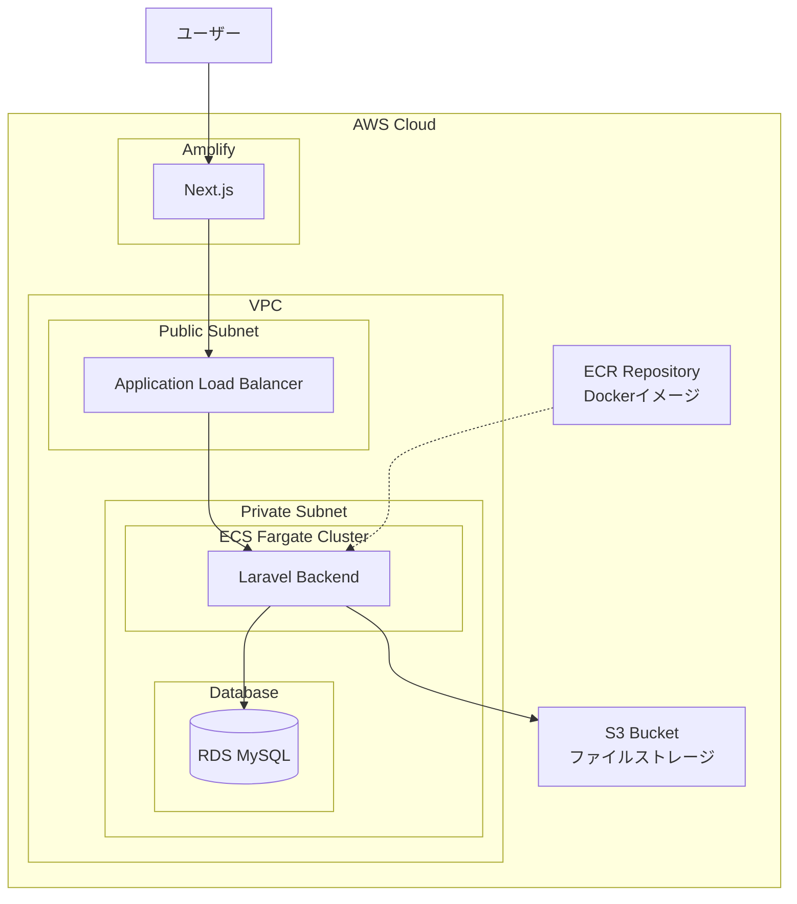

## 状況

携わっているプロジェクトで α 版を実装してデプロイ → テスト運用することとなった．完全にゼロから構築する必要があるため，AWS の ECR と ECS を中心に CDK でインフラを構築した．バックエンドは Laravel で，フロントエンドは Next.js である．

開発時は Docker-compose で操作を行い，本番運用も Docker コンテナで行うこととした．開発 → デプロイの運用は GitHub Actions で自動化した．

開発は当面自分一人で行うため，開発やデプロイの手間を減らすことを重視した．筆者はインフラの知見がなく初期の構築で罠にハマりまくって時間を溶かしたため，自戒を込めてこの記事を作成した．

## 全体的な構成と採用理由

構成は以下な感じ（他にもあるが出てこない部分は省いている）．本番環境とステージング環境で同じ環境を用意して運用している．



採用理由は主に以下の通り．

1. 全体の構成をコードで管理したい．AWS のコンソールでいじるのは面倒（というか自分には無理）．

2. 開発環境と本番環境をできるだけ同じにしたい．Docker-compose で開発しているため，本番環境も Docker コンテナで運用することとした．

3. サーバの環境由来の問題を排除したい．PHP のバージョンや拡張ライブラリの違いなど．

## 今回使用した技術の簡単な説明

説明は公式なりググるなりで出てくるので個人的な認識を簡単に記す．

### ECR とは

ECR は Elastic Container Registry の略．コンテナイメージのリポジトリ．AWS 上にコンテナを置いておき，各サービスが必要なタイミングでコンテナを ECR から取ってくるイメージ．ビルドしたコンテナを ECR に push する必要があるがここで結構ハマった．

### ECS とは

ECS は Elastic Container Service の略．Docker コンテナを AWS 上でいい感じに動かせるサービス．ECR からコンテナを取ってきて，それを動かす．複数動かすこともできる．

### CDK とは

CDK は Cloud Development Kit の略．AWS のインフラストラクチャをコードで定義してデプロイや管理できるソフトウェア開発フレームワークである．上記の ECR や ECS も CDK で定義できる．TypeScript などの慣れた言語で書ける．

## 良かった点

基本的にメリットが圧倒的に大きいため採用している．

### 全部コードで管理できるのがよい

CDK のファイルに構成を記述することで，インフラの構成をコードで管理できる．構成を変更したい場合はファイルを変更して `cdk deploy` するだけで変更が適用されるため簡単かつ漏れもない．

毎回手動でコンソール画面を操作する場合，漏れが生じたり本番とステージングで操作ミスが発生する可能性があるが，コマンドならばその心配がない．

今回のように少ないリソースで運用する場合は必須レベルだと感じた．

### サーバの状態が明確

サーバの状態が Dockerfile に書かれているとおりとなるため，サーバ由来の問題に悩まされない．

例えば，max_file_upload などの設定を変更したい場合，Dockerfile に書いてコンテナをビルドし直すだけでよい．PHP のバージョンを変えたい場合も，Dockerfile を変更してコンテナをビルドし直すだけでよい．

手動でサーバを運用する場合，自分で設定を変更する必要があり，本番とステージング双方に操作を行わなければならない．大体ミスするし，他の操作と同時に行う場合に漏れが発生して設定が適用されない，みたいなことが起きる．

## 罠

### コンテナがないとデプロイできない

CDK のファイルに構成を正確に記述すればアプリケーションが動く．そう考えていた時期が私にもありました．

CDK でコンテナを動かすサービスを下記のように定義したが，`cdk deploy` してもエラーとなって一生構成できない．

```typescript
const backendService = new FargateService(this, `FantasticBackendService`, {
  cluster,
  serviceName: `FantasticBackendService`,
  taskDefinition: backendTaskDef,
  securityGroups: [serviceSecurityGroup],
  desiredCount: 1,
  assignPublicIp: false,
  vpcSubnets: {
    subnetType: SubnetType.PRIVATE_WITH_EGRESS,
  },
  enableExecuteCommand: true,
});
```

これはコンテナイメージがないためである．ECR にコンテナイメージを push しておかないとデプロイできない．初期状態で `cdk deploy` した場合，ECR の定義も実行されるが，コンテナの push は行われないため構成全体ではエラーになる．

結局，下記の手順で解決した．この問題は最初の状況でしか発生しないため以降の運用には影響はないが，開発用ドキュメントに記載して以降環境を追加する際にハマらないようにした．

1. 初期状態では下記の `desiredCount` を 0 にして `cdk deploy` する．
2. コマンドでコンテナイメージを ECR に push する．
3. `desiredCount` を 1 にして再度 `cdk deploy` を行い，サービス側にコンテナをもってくる．

### 環境変数の設定

アプリケーションから DB に接続できない問題の大体がこれ．

CDK でコンテナを定義する際に環境変数を設定するが，DB の接続情報を環境変数で渡す際に，DB のホスト名を `mysql` としている．これは Docker-compose で開発している際に DB のホスト名を `mysql` にしていたためで，本番でも RDS で MySQL を使用している．**これがないと詰む．**

```typescript
const backendContainer = backendTaskDef.addContainer(
  `FantasticBackendContainer`,
  {
    image: ContainerImage.fromEcrRepository(backendRepo, "latest"),
    containerName: `FantasticBackendContainer`,
    logging: new AwsLogDriver({
      streamPrefix: `fantastic-backend`,
    }),
    environment: {
      DB_CONNECTION: "mysql",
      DB_HOST: dbInstance.instanceEndpoint.hostname,
      DB_DATABASE: "hoge",
      DB_USERNAME: "fuga",
      AWS_BUCKET: s3Bucket.bucketName,
      AWS_DEFAULT_REGION: this.region,
      APP_ENV: envName,
      LOG_CHANNEL: "stderr",
      APP_KEY: process.env.LARAVEL_API_KEY,
      FILESYSTEM_DISK: "s3",
    },
    secrets: {
      DB_PASSWORD: ECSSecret.fromSecretsManager(dbSecret, "password"),
    },
  }
);
```

書いていない場合は DB に接続できなくてエラーが発生すると考えていたが，下記の挙動になった．

1. `cdk deploy` してコンテナが動いていることを確認．
2. 初回のマイグレーションを行う必要があるため，ECS のコンソールでコマンドを手動で実行する．
3. ログを見ると正常にマイグレーションが完了している．
4. クライアントツールで DB（RDS の MySQL）に接続してもテーブルが作成されていない．

よく確認するとどうやらコンテナから RDS につながっているわけではなく，sqlite のファイルに対してマイグレーションを行っていたようだ．おそらく Laravel の仕様によるものと考えているが，他にも環境変数の設定漏れでエラー吐いていたこともあり，ちゃんと設定しないといけない．

### 名前つけないと毎回変わる問題

DB に接続できない問題の残りがこれ．上記の環境変数を解決した後，テーブルが正しく作成されたがアプリケーション側から DB に接続できない問題が発生した．

原因は定義したセキュリティグループが適用されておらず，DB にアクセスできなかったこと．セキュリティグループは CDK で定義しているが，名前を明確に定義しないとセキュリティグループの名前が毎回変わる．

毎回生成される名前を活用する方法もありそうだが，名前を明確に定義しておくことでセキュリティグループの名前が変わらないようにした．最適解ではない可能性もあるので後ほど調べる．

## 採用した技術で今後確認したい部分

### コスト

ある程度運用してコストの状況を確認したい．

### 本番とステージングの運用

現状は本番とステージングで全く同じ環境を用意しているが，特にステージングはもう少し軽量な環境で運用できないか検討したい．コストも見て要検討．

## まとめ

CDK で ECR と ECS を構築した．構築にはやや苦労したが，構築後は運用が楽になった．目論見どおり自分一人体制でも運用できそうな状況に持っていけたので，採用したメリットは大きかった．

また，自力でゼロからアプリケーションを運用するところまで行えたので，各種勘所が身についたという経験値も大きかった．インフラ（特にクラウド周り）の知見が少ない人間でも AI を使えば意外となんとかなる．

以上だ( `･ω･)b
