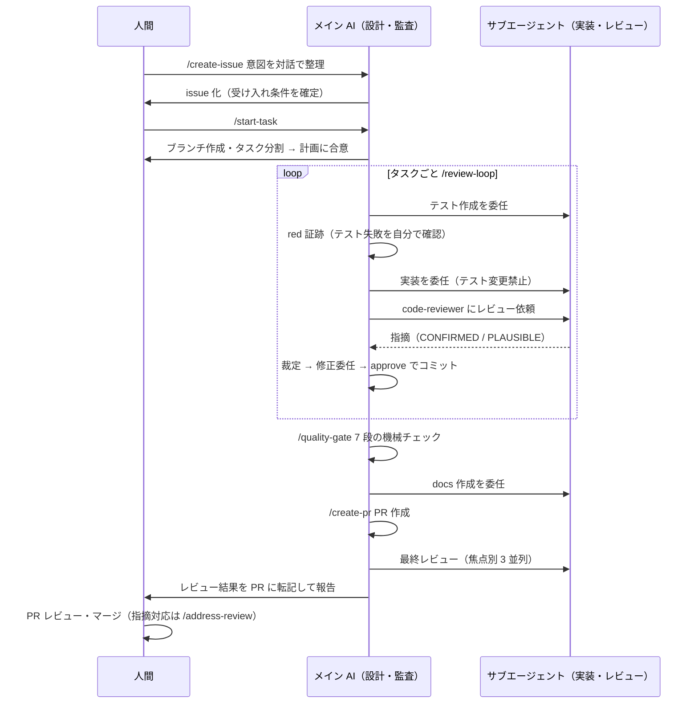

# Claude Code による AI 駆動開発フロー

Fable を活用して改善した Claude Code 中心の開発フローを紹介する．人間の作業は，issue での意図確定・タスク計画への合意・PR レビューとマージに絞り，その間の実装・テスト・レビュー・PR 作成は AI が自律的に行う．全体の構成は Claude 公式の記事（[https://code.claude.com/docs/en/agent-sdk/agent-loop](https://code.claude.com/docs/en/agent-sdk/agent-loop)）を参考に検討し，これまでの開発フロー及び数回の実運用を通じて改善した．

今回の開発フローでは，各サブエージェント間における情報共有を最小化し，各段階を独立させることで誤認識や忖度を防いだ．

ちなみに，操作は Claude のデスクトップアプリを使用して行っている．筆者はこれまでターミナルで操作していたが，並列起動や状況の確認においてデスクトップアプリの方が便利だった．今回改善を行ったプロジェクトは Next.js を中心に構成されている．

## 1. 背景と課題

AI に実装の大半を任せると，次の 3 つが問題になる．問題が発生していないかどうか人間がレビューする必要があり，AI を用いているにも関わらず人間の負荷が高い状態が常態化していた．

1. 品質: AI の「動きました」は信用できない．未検証の完了報告や，形だけのテストが混ざる．
2. 人間の負荷: AI は diff を量産する．人間が全行レビューするとボトルネックになり，任せた意味がなくなる．
3. 逸脱: 文章のルールだけでは守られない．保護ブランチへの直コミットや，フロー途中での停止が起きる．

対策の方針:

- 品質保証は AI 内で多層化する（テストファースト + 独立レビュアー + 機械チェック）．
- 人間のレビューは「AI レビューの結果 + 高リスク箇所の要約」を入力にして焦点を絞る．
- 破ってはならないルールは hooks（ツール実行への割り込み）で機械的に強制する．

## 2. フロー全体像

1 issue = 1 ブランチ = 1 PR，1 タスク = 1 コミット．各段階は skill（スラッシュコマンド）として手順書化した．

## 3. 人間と AI の役割分担

人間と AI 間はもちろん，AI 間でも役割を分ける．Fable はオーケストレーターとして設計・監査に専念し，実装とレビューは別のサブエージェントに委任する．

| 担当                                            | 役割                                                                        |
| ----------------------------------------------- | --------------------------------------------------------------------------- |
| 人間                                            | 意図・受け入れ条件の確定 / タスク計画・設計判断の承認 / PR レビュー・マージ |
| メイン AI（Fable 5）                            | 設計・タスク分割・委任・監査・レビュー裁定．原則実装しない                  |
| 実装サブエージェント（Sonnet / Opus）           | テスト作成・実装・docs・修正                                                |
| レビューサブエージェント（code-reviewer, Opus） | 読み取り専用のコードレビュー                                                |

分担の理由:

- コスト: 単価が最も高いメインのモデルは判断に集中させ，実装は難易度に応じて Sonnet / Opus に委任する．
- 独立性: レビュアーは実装と別コンテキストで起動し，レビュアーには実装者の説明・完了報告・自己評価を渡さない．実装者の思い込みがレビューに持ち込まれない．
- 利害の分離: 実装エージェントはテストファイル変更禁止．中核ロジック（スコア計算・バリデーション等）ではテスト作成と実装を必ず別エージェントに分け，テスト作成側に実装コードを見せない．
- 監査: サブエージェントの完了報告は主張として扱い，メイン AI が自身のツール実行（テスト実行・diff 読解）で裏取りしてから次工程へ進む．

## 4. 各段階のポイント

### /create-issue — 意図の確定

- issue が以降の工程への唯一の意図入力．ここの品質がフロー全体の品質を決める．
- 受け入れ条件は「入力・操作 → 期待結果」でテストケース名に翻訳できる粒度で書く．境界・異常系（未認証・0 件・他人のリソース等）を最低 1 つ対話で確認する．
- 設計の分岐は対話で決定し，決定表として issue に記録する．スコープ外も明記する．

### /start-task — 分割と計画

- develop 起点の feature ブランチを作成し，diff 400 行以内を目安にタスク分割する．
- 中核ロジックと高リスク（スキーマ変更・認可・未認証でアクセスできる匿名画面）のフラグをタスクに付け，後工程のレビュー強度に反映する．
- 計画を提示して人間の合意を取ってから実装に入る．

### /review-loop — 実装の中心ループ

タスク 1 件を次の同期ループで処理する．

1. テスト作成（サブエージェント）: 受け入れ条件・シグネチャ・docs だけを渡す．
2. red 証跡: メイン AI 自身がテストを実行し失敗を確認する．最初から green なら「何も検証していないテスト」を疑い差し戻す．
3. 実装（サブエージェント．中核ロジックではテスト作成と必ず別のエージェント）: テストファイルの変更を禁止する．テスト側の誤りと判断した場合は手を付けず報告させ，メイン AI が裁定する．
4. 機械チェック: typecheck・lint・対象テストが通るまでレビューに出さない．
5. レビュー: code-reviewer に受け入れ条件・diff・red → green 証跡だけを渡す．レビュアーは指摘ごとに自ら反証を試み，反証に失敗した（実在を確認できた）指摘を CONFIRMED，確認しきれないものを PLAUSIBLE と宣言する．具体的な失敗シナリオを書けない指摘は報告させない．
6. 裁定: approve = CONFIRMED の Critical / Major（重大度の上位 2 段階）がゼロ．PLAUSIBLE はメイン AI がコードを読んで裁定する．
7. 修正: 指摘は「仮説」として修正エージェントへ渡す．誤指摘と判断したら WON'T FIX で反論でき，メイン AI が裁定する．

ループ上限は 3 周．収束しなければ設計かタスク分割の問題を疑い，人間に相談する．

### /quality-gate — 機械チェック

typecheck → lint → lint:typed → format → test → build など．エラー修正後は必ず 1 からやり直し，全 green まで繰り返す．

### /create-pr — PR と最終レビュー

- ドキュメントは UX（ユーザー意図）/ Feature（機能仕様）/ Screen（画面仕様）の 3 層で運用している．UX は issue 時点で確定済みのため，ここで Feature / Screen を実装内容に基づき作成・更新してから PR を作る．
- 最終レビューは行単位ではなく全体整合（受け入れ条件の全体充足・タスク間の一貫性・schema / docs 整合）の確認．焦点の異なる 3 本のレビューを並列実行し，高リスクブランチ（スキーマ変更・認可・データ削除・集計ロジック等を含む場合）は該当焦点をもう 1 本追加する．2 本のうち片方にしか出ない Critical / Major は PLAUSIBLE としてメイン AI が裁定する．
- 統合結果を PR コメントに転記し，PR 本文に高リスク箇所と WON'T FIX 裁定を明記して，人間レビューの焦点を誘導する．
- ここまで完了して「人間のレビュー待ち」になった状態が AI の作業完了．コミットや push では止まらないようにする．
- 人間は PR のコメントに反映されたレビュー結果を確認し，必要に応じて指摘対応を行う．

### 人間レビュー → /address-review

- 人間の指摘に対応・返信する．仕様変更を伴う指摘は人間に確認する．
- AI レビューをすり抜けた指摘・成立した誤指摘は校正ファイル（review-calibration.md）に一般化して記録し，以降のレビュー精度を改善する．

## 5. 実例: issue から PR の流れ

最近のコミット例を示す．内容は適当に抽象化している．+4,741 行 / −99 行．

- issue: 設計論点を対話で確定し決定表として記録．受け入れ条件は「入力・操作 → 期待結果」の粒度で確定．
- 実装: 6 タスク（データモデル → サーバー修正 → フロント修正 → docs）= 4 コミット．全タスクがレビュー 1 周目で approve（Minor 4 件は反証の上，現状維持と裁定）．
- 最終レビュー: schema 変更・集計・匿名画面を含む高リスクブランチのため，correctness と convex-perf を二重化した計 5 本を実施．Critical / Major 0 件，Minor 6 件（1 件修正，2 件は対応不要と裁定，3 件は既存負債として別 issue 化）．結果を PR コメントに転記．
- 人間: issue の対話・計画への合意・PR レビューとマージのみ．

## 6. つまずきと対策

運用で実際に起きた問題と対策．前節までの仕組みの多くは，この失敗が起源になっている．

| 問題                                                                                 | 対策                                                                                           |
| ------------------------------------------------------------------------------------ | ---------------------------------------------------------------------------------------------- |
| 完了報告の過信．「テスト通りました」が未検証                                         | 検証（テスト実行・diff 読解）はメイン AI が自分で行う設計に（red 証跡・監査）                  |
| コミットで停止し，PR 作成まで進まない                                                | 完了の定義（PR 作成 + レビュー転記 + 人間待ち）を明文化し，停止時に hook が警告                |
| 再帰委任．サブエージェントが「実装は委任せよ」のルールを自分に適用し，成果ゼロで終了 | 委任プロンプト冒頭に，自身がサブエージェントであり再委任禁止・委任ルール適用外であることを明記 |
| レビュアーの誤指摘で修正ループが空転                                                 | 反証と失敗シナリオの必須化，修正側の WON'T FIX 反論権，誤指摘・すり抜けの校正記録              |
| 形骸化したゲート                                                                     | カバレッジ閾値は撤廃し，テスト品質はレビュー観点（トートロジー・過剰モックの検出）で担保       |

## 7. 導入に必要なもの

| 構成要素                        | 内容                                                                                         |
| ------------------------------- | -------------------------------------------------------------------------------------------- |
| CLAUDE.md                       | フローの厳守事項・コーディング原則・委任ルール（プロジェクト用）+ 開発哲学（ユーザー用）     |
| .claude/skills/（6 種）         | 各段階の手順書．上記フローの実体．                                                           |
| .claude/agents/code-reviewer.md | レビュー観点・severity 基準・反証パス・出力形式の定義．                                      |
| .claude/hooks/（4 種）          | 保護ブランチコミット禁止 / push 前ゲート / 編集時フォーマット / 停止時のフロー完遂チェック． |
| review-calibration.md           | 誤指摘・すり抜けの校正記録（レビュー時に毎回参照）．                                         |
| docs/（UX / Feature / Screen）  | 3 層ドキュメントと更新履歴．issue 時に UX，PR 時に Feature / Screen を更新．                 |
| モデル構成                      | メイン: Fable 5 / 実装: Sonnet・Opus / レビュー: Opus                                        |
| GitHub CLI（gh）                | issue・PR 操作．                                                                             |

注意: 手順書の粒度・並列度はメインのモデル性能を前提に調整している．モデルを変える場合は該当モデルの公式プロンプティングガイドと照合して見直す．

## 8. まとめ

- 人間の関与は入口（意図の確定・計画への合意）と出口（PR レビュー・マージ）に集約し，その間はテストファースト・独立レビュー・機械チェックの多層で品質を担保する．
- ルールは「文章で指示」より「機械的に強制」（hooks）と「構造で防止」（コンテキスト分離・情報を渡さない設計）が有効だった．
- 誤指摘・すり抜けを記録して手順書側を更新する校正ループを持ち，フロー自体を改善し続ける．

以上だ( `･ω･)b
